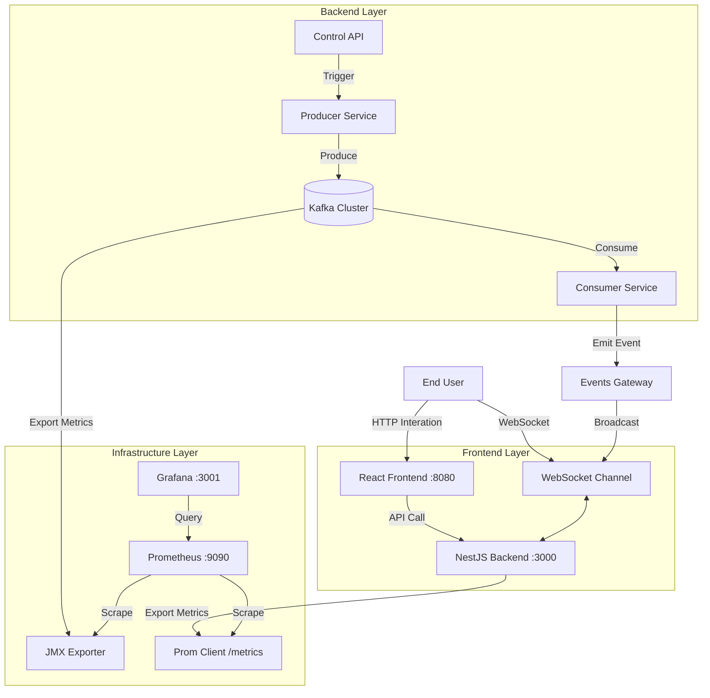

# Kiến Trúc và Tài Liệu Kỹ Thuật

Tài liệu này mô tả chi tiết kiến trúc, logic xử lý, luồng dữ liệu và cách vận hành của hệ thống Demo Kafka Real-time.

---

## 🏗 Thông Tin Kiến Trúc (Architecture)

Hệ thống được thiết kế theo mô hình **Event-Driven Microservices**, tách biệt hoàn toàn giữa luồng xử lý dữ liệu (Kafka Backend) và hiển thị (React Frontend).

### Sơ Đồ Tổng Quan



### Tech Stack

| Component | Technology | Role |
|-----------|------------|------|
| **Frontend** | React 18, TypeScript, TailwindCSS, React Flow | Giao diện người dùng, visualize cluster node, message stream. |
| **Backend** | NestJS, Socket.IO, KafkaJS | Xử lý logic nghiệp vụ, Kafka producer/consumer, exposes REST API & WebSocket. |
| **Messaging** | Apache Kafka 3.6+ (KRaft Mode) | Core event bus. Chạy mode KRaft (không ZooKeeper). Cluster 3 Broker. |
| **Monitoring** | Prometheus, Grafana | Thu thập và hiển thị metrics hệ thống và ứng dụng. |
| **Infra** | Docker, Docker Compose | Containerization và Orchestration. |

---

## 🔄 Luồng Dữ Liệu (Data Flow)

Dữ liệu đi qua hệ thống theo quy trình khép kín sau:

1.  **Trigger (Kích hoạt):**
    *   Người dùng nhấn "Start Stream" trên Frontend hoặc gọi API `/demo/start`.
    *   `DemoService` kích hoạt một interval timer.

2.  **Production (Sản xuất):**
    *   Mỗi chu kỳ (2s), `DemoService` tạo một batch message giả lập (đơn hàng, log, etc.).
    *   `ProducerService` đẩy message vào topic `demo-events` thông qua `KafkaJS`.
    *   Message được phân chia vào 3 partition theo thuật toán Round-Robin hoặc Key-Hashing.

3.  **Consumption (Tiêu thụ):**
    *   3 Consumer Instances trong cùng group `demo-shared-group` cùng lắng nghe topic.
    *   Kafka tự động cân bằng (rebalance) partition cho các consumer (Ví dụ: C1 -> P0, C2 -> P1, C3 -> P2).
    *   `ConsumerService` nhận message từ Kafka.

4.  **Real-time Delivery (Phân phối):**
    *   Ngay khi nhận message, `ConsumerService` gọi `EventsGateway`.
    *   `EventsGateway` phát sự kiện `kafka-message` qua WebSocket tới tất cả client đang kết nối.
    *   Frontend nhận sự kiện và render message mới nhất lên `MessageStream` và `ClusterVisualizer` (hiệu ứng tia laser).

5.  **Monitoring (Giám sát):**
    *   Song song với xử lý, `MetricsService` ghi nhận các con số: `messages_produced`, `messages_consumed`, `latency`.
    *   Prometheus scrape dữ liệu này mỗi 10-15s.

---

## 🧩 Các Xử Lý Chính (Core Logic)

### 1. Backend Logic
*   **Dynamic Partitioning:** Backend định nghĩa 3 broker và topic có 3 partition. Việc này cho phép demo khả năng scale-out.
*   **Consumer Seek:** API `/demo/seek` cho phép Admin reset offset của một Consumer Group về 0 hoặc một vị trí bất kỳ để replay lại dữ liệu.
*   **Singleton Producer:** `ProducerService` được khởi tạo dạng Singleton để tối ưu connection tới Kafka cluster.
*   **Parallel Consumption:** `ConsumerService` khởi tạo nhiều instance consumer chạy song song (trong code demo dùng vòng lặp để tạo 3 consumer `Consumer-1`, `Consumer-2`, `Consumer-3` trong cùng 1 process để mô phỏng).

### 2. Frontend Logic
*   **Visualizer Engine:** Sử dụng `React Flow` để vẽ sơ đồ node.
    *   **Custom Nodes:** Các node Consumer, Broker được customize để hiển thị trạng thái active (nhấp nháy khi có data).
    *   **Interactive Edge:** Dây nối giữa các node có animation chạy khi có message đi qua.
*   **WebSocket Hook:** Sử dụng Custom Hook `useSocket` để quản lý kết nối, tự động reconnect khi mất mạng.
*   **State Management:** Dữ liệu message được lưu trong React State (giới hạn 50-100 message cuối) để tránh tràn bộ nhớ trình duyệt.

---

## 🛠 Cách Setup & Deploy

### A. Yêu cầu hệ thống
*   OS: Linux (Ubuntu 20.04/22.04 recommended), MacOS, hoặc Windows (WSL2).
*   RAM: Tối thiểu 4GB (Khuyên dùng 8GB+ vì chạy 3 Broker Kafka + Monitoring stack).
*   Docker & Docker Compose đã được cài đặt.

### B. Môi trường Development (Local)
Đây là cách nhanh nhất để chạy toàn bộ hệ thống.

1.  **Clone source code:**
    ```bash
    git clone <repo-url>
    cd kafka-demo/demo
    ```

2.  **Thiết lập môi trường:**
    ```bash
    cp .env.example .env
    # Mặc định cấu hình đã chuẩn cho local
    ```

3.  **Khởi chạy (Docker Compose):**
    ```bash
    docker-compose up -d
    ```
    *Lệnh này sẽ pull images và start 8 containers (3 Kafka, 1 Backend, 1 Frontend, Prometheus, Grafana, Kafka UI).*

4.  **Truy cập:**
    *   Frontend: [http://localhost:8080](http://localhost:8080)
    *   Grafana: [http://localhost:3001](http://localhost:3001) (Login: admin/admin)
    *   Kafka UI: [http://localhost:8081](http://localhost:8081)

5.  **Dừng hệ thống:**
    ```bash
    docker-compose down
    # Hoặc để xóa sạch cả data volume:
    docker-compose down -v
    ```

### C. Triển khai lên VPS (Production-like)

Có script tự động `setup-vps.sh` hỗ trợ triển khai trên Ubuntu.

1.  **Upload code lên VPS.**
2.  **Chạy script:**
    ```bash
    cd scripts
    chmod +x setup-vps.sh
    ./setup-vps.sh
    ```
3.  **Cấu hình Firewall:**
    Mở các port: `80` (Frontend), `3000` (API), `3001` (Grafana) nếu cần public access.

---

## 🔍 Monitoring (Giám sát)

Hệ thống tích hợp sẵn Prometheus và Grafana.

### Các Metrics quan trọng
*   `kafka_messages_produced_total`: Tổng số message đã gửi.
*   `kafka_messages_consumed_total`: Tổng số message đã xử lý.
*   `websocket_active_connections`: Số lượng user đang xem realtime.
*   `process_cpu_seconds_total`: CPU usage của backend.

### Cấu trúc Dashboard
File cấu hình dashboard nằm tại: `monitoring/grafana/dashboards/kafka_demo.json`. Dashboard này tự động hiển thị:
*   Throughput (Msg/s) cho cả Producer và Consumer.
*   Sức khỏe của Backend Node.js process.
*   Số lượng kết nối WebSocket active.
